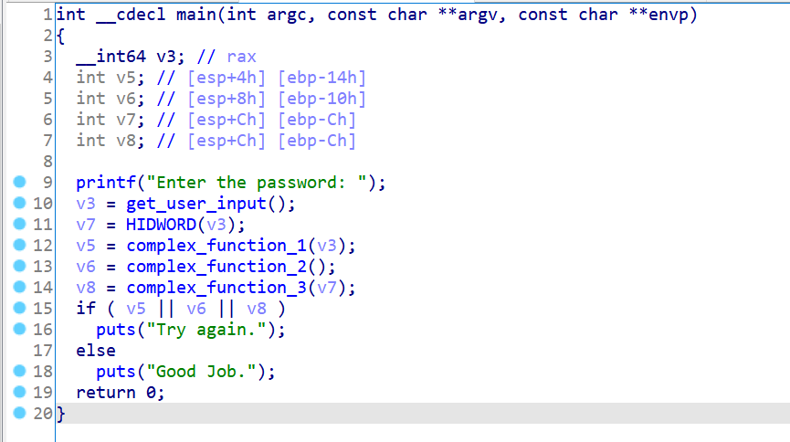
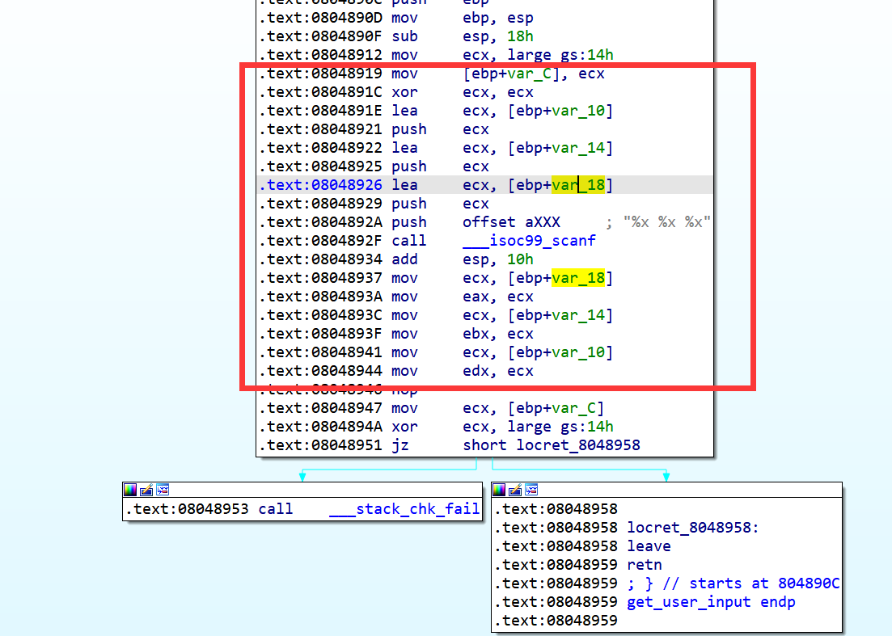
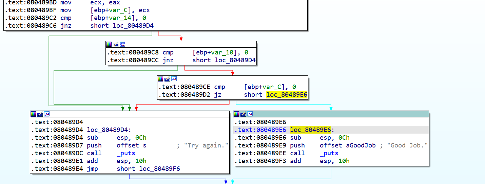
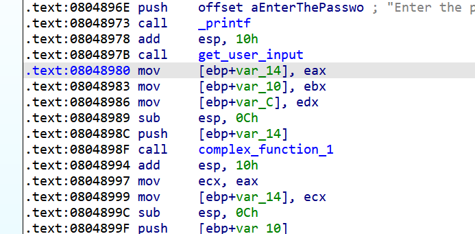
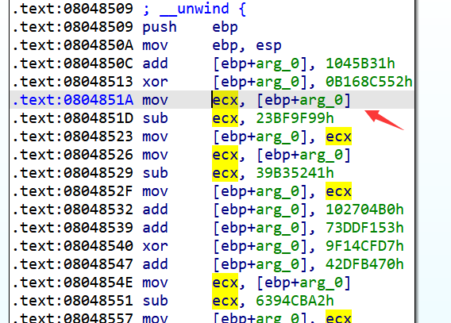
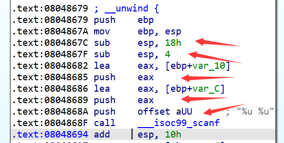
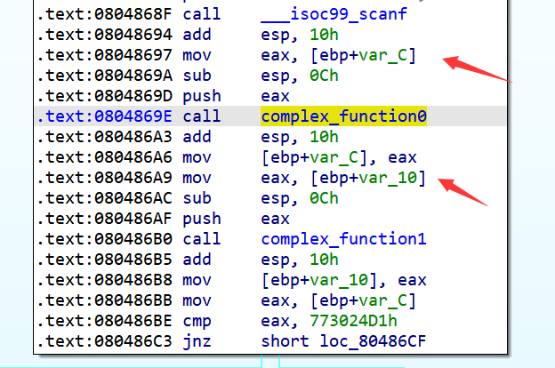
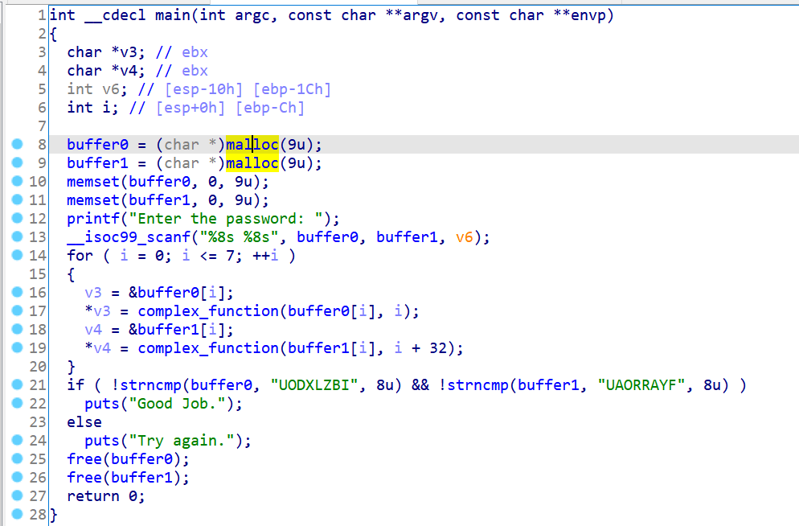
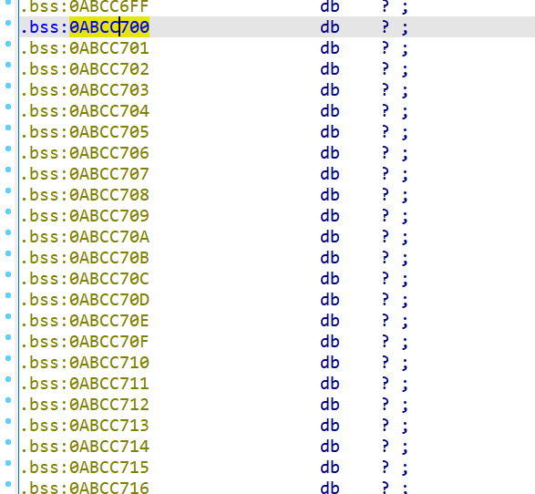
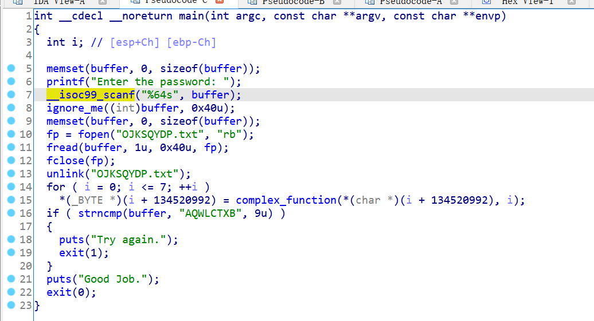

之前提到过，angr在默认情况下只会符号化从标准输入流中读取的数据，而实际情况往往需要我们符号化其他数据，如寄存器、某块内存甚至是某个文件。这一节我们来学习如何手动符号化并且利用angr内置的约束求解器对符号值进行约束求解。

## 03_angr_symbolic_registers

这题的逻辑也非常简单：



当然了，这种题显然也是可以用之前的方法跑出来的：

```python
import angr

proj = angr.Project('../dist/03_angr_symbolic_registers')
state = proj.factory.entry_state()
simgr = proj.factory.simgr(state)
simgr.explore(
    find=lambda state : b'Good Job.' in state.posix.dumps(1),
    avoid=lambda state: b'Try again.' in state.posix.dumps(1)
)
print(simgr.found[0].posix.dumps(0))
```

输出：

```python
b'b9ffd04e ccf63fe8 8fd4d959'
```

但为了体现本节的主题，即手动符号化与约束求解，我们尝试换一种方法来解决这道题。

要准确进行符号化，我们得从汇编着手分析：




我们从以上用红色框框标记的关键指令处可以分析出get_user_input读入的3个int是分别保存在eax, ebx和edx寄存器中的，因此我们可以把这三个寄存器符号化：

```python
password0 = claripy.BVS('password0', 32)
password1 = claripy.BVS('password1', 32)
password2 = claripy.BVS('password2', 32)
state.regs.eax = password0
state.regs.ebx = password1
state.regs.edx = password2
```

然后让程序跑到0x080489E6这个地址：

```python
simgr.explore(find=0x80489E6)
```



在这个地址对应的状态下对我们之前注入的符号值进行约束求解，之前说过SimState内置的约束求解器是会保存当前的路径约束的，所以我们不需要添加额外约束了：

```python
solver = simgr.found[0].solver
print(f'password0: {hex(solver.eval(password0))}')
print(f'password1: {hex(solver.eval(password1))}')
print(f'password2: {hex(solver.eval(password2))}')
```

完整代码：

```python
import angr
import claripy

proj = angr.Project('../dist/03_angr_symbolic_registers')
state = proj.factory.blank_state(addr=0x8048980)
password0 = claripy.BVS('password0', 32)
password1 = claripy.BVS('password1', 32)
password2 = claripy.BVS('password2', 32)
state.regs.eax = password0
state.regs.ebx = password1
state.regs.edx = password2
simgr = proj.factory.simgr(state)
simgr.explore(find=0x80489E6)
solver = simgr.found[0].solver
print(f'password0: {hex(solver.eval(password0))}')
print(f'password1: {hex(solver.eval(password1))}')
print(f'password2: {hex(solver.eval(password2))}')
```

输出：

```python
password0: 0xb9ffd04e
password1: 0xccf63fe8
password2: 0x8fd4d959
```

注意这里的初始state是通过blank_state函数而不是entry_state函数获得的：

```python
state = proj.factory.blank_state(addr=0x8048980)
```

因为在0x8048980之前的指令对我们的求解其实是没有任何作用的，包括get_user_input函数，因为接下来我们就要将get_user_input函数的结果符号化了，而不是让angr自动帮我们符号化通过scanf读取的数据：



可能有同学还会有疑问：如果直接从0x8048980这个地址开始符号执行，那初始的状态是什么样的呢？根据x86汇编常识，像eax，ebx，ecx这样的寄存器是上下文无关的，也就是说一个函数内不会引用在函数外部设置的eax，ebx或者ecx的值，而是在函数内部对寄存器重新初始化并使用，例如：



所以我们用blank_state获取的状态，即时初始的一些寄存器处于未初始化状态也是丝毫没有影响的，因为它们马上就会被初始化：

```python
>>> state.regs.ecx
<BV32 reg_c_3_32{UNINITIALIZED}>
```

至于esp，angr会给他们一个默认的初值，使接下来的函数调用不会爆炸：

```python
>>> state.regs.esp
<BV32 0x7fff0000>
```

ebp的初始值仍然是未初始化的，但对我们后续的符号执行没有影响，不管它就行：

```python
>>> state.regs.ebp
<BV32 reg_1c_3_32{UNINITIALIZED}>
```

这部分解释起来比较困难，需要读者本身对x86汇编非常之熟悉，所以如果大家还没有弄明白，是因为对x86汇编还不够熟悉，而不是作者没有解释清楚（误）。

## 04_angr_symbolic_stack

了解了对寄存器的符号化之后，我们再看看如何对栈空间内的数据进行符号化。还是先来看看这题的逻辑：


我们仍然从scanf的后面一条指令开始：


```python
state = proj.factory.blank_state(addr=0x8048694)
```

之前我们说过通过blank_state获取初始状态，ebp的值是未约束的。在这题中，我们之后要向栈中push符号值，并且通过ebp索引这些符号值（比如`[ebp+var_C]`），所以我们得让ebp有一个正确的初值了。之所以说是正确的初值，是因为我们跳过了函数开头对栈的调整，因此我们还需要手动调整ebp的值：



ebp的值是什么不重要，我们只需要保证它和esp的偏移是正确的即可，对前面的汇编指令进行分析我们可以得出此时ebp的偏移量为：0x18+4+4+4+4=40

```python
state.regs.ebp = state.regs.esp + 40
```

然后对esp的值执行调整，使我们接下来push进去的符号值恰好在[ebp+var_10]和[ebp+var_C]这两个位置，记得push完之后要把esp调回来哦：

```python
state.regs.esp = state.regs.ebp - 0xC + 4
password0 = claripy.BVS('password0', 32)
password1 = claripy.BVS('password1', 32)
state.stack_push(password0)
state.stack_push(password1)
state.regs.esp = state.regs.ebp - 40
```



完整代码：

```python
import angr
import claripy

proj = angr.Project('../dist/04_angr_symbolic_stack')
state = proj.factory.blank_state(addr=0x8048694)
state.regs.ebp = state.regs.esp + 40
state.regs.esp = state.regs.ebp - 0xC + 4
password0 = claripy.BVS('password0', 32)
password1 = claripy.BVS('password1', 32)
state.stack_push(password0)
state.stack_push(password1)
state.regs.esp = state.regs.ebp - 40
simgr = proj.factory.simgr(state)
simgr.explore(find=0x80486E1)
solver = simgr.found[0].solver
print(f'password0: {hex(solver.eval(password0))}')
print(f'password1: {hex(solver.eval(password1))}')
```

输出：

```python
password0: 0x65954334
password1: 0x8dffa41f
```

这题的关键在于维护堆栈，同样需要读者对x86汇编语言有一定的理解。当然这题有更简单的写法，这一节所有的题都有简单写法，只不过为了让大家能够学到angr的用法而故意写得复杂了。

## 05_angr_symbolic_memory

这题的输入保存在一个全局变量`user_input`里，逻辑还是比较简单：


我们只需要对`user_input`进行符号化即可，也就是对0xA1BA1C0开始的32字节内存进行符号化，对内存进行符号化的方法如下：

```python
password0 = claripy.BVS('password0', 64)
password1 = claripy.BVS('password1', 64)
password2 = claripy.BVS('password2', 64)
password3 = claripy.BVS('password3', 64)
state.mem[0xA1BA1C0].uint64_t = password0
state.mem[0xA1BA1C0 + 8].uint64_t = password1
state.mem[0xA1BA1C0 + 16].uint64_t = password2
state.mem[0xA1BA1C0 + 24].uint64_t = password3
```

如果我们要获取内存中的数据（具体值或者符号值），可以这样用：

```python
>>> state.mem[0xA1BA1C0].uint64_t.resolved
<BV64 password0_0_64>
```

完整代码如下：

```python
import angr
import claripy

proj = angr.Project('../dist/05_angr_symbolic_memory')
state = proj.factory.blank_state(addr=0x80485FE)
password0 = claripy.BVS('password0', 64)
password1 = claripy.BVS('password1', 64)
password2 = claripy.BVS('password2', 64)
password3 = claripy.BVS('password3', 64)
state.mem[0xA1BA1C0].uint64_t = password0
state.mem[0xA1BA1C0 + 8].uint64_t = password1
state.mem[0xA1BA1C0 + 16].uint64_t = password2
state.mem[0xA1BA1C0 + 24].uint64_t = password3
simgr = proj.factory.simgr(state)
simgr.explore(find=0x804866A)
solver = simgr.found[0].solver
print(f'password0: {solver.eval(password0, cast_to=bytes)}')
print(f'password1: {solver.eval(password1, cast_to=bytes)}')
print(f'password2: {solver.eval(password2, cast_to=bytes)}')
print(f'password3: {solver.eval(password3, cast_to=bytes)}')
```

输出：

```python
password0: b'RNGHTXAN'
password1: b'EWPTFSVJ'
password2: b'CWHUAGML'
password3: b'ULAPCDMX'
```

## 06_angr_symbolic_dynamic_memory

这题使用了malloc函数来动态分配内存，因此输入的地址就不是固定的了：



但我们仍然可以在内存中选定一块区域作为输入的地址，比如说在.bss段选定一块未使用的16字节区域，然后对输入进行符号化：



```python
password0 = claripy.BVS('password0', 64)
password1 = claripy.BVS('password1', 64)
state.mem[0xABCC700].uint64_t = password0
state.mem[0xABCC700 + 8].uint64_t = password1
```

然后将buffer0和buffer1的地址设成我们刚刚选定的地址：


```python
state.mem[0xABCC8A4].uint32_t = 0xABCC700
state.mem[0xABCC8AC].uint32_t = 0xABCC700 + 8
```

完整代码：

```python
import angr
import claripy

proj = angr.Project('../dist/06_angr_symbolic_dynamic_memory')
state = proj.factory.blank_state(addr=0x8048696)
password0 = claripy.BVS('password0', 64)
password1 = claripy.BVS('password1', 64)
state.mem[0xABCC700].uint64_t = password0
state.mem[0xABCC700 + 8].uint64_t = password1
state.mem[0xABCC8A4].uint32_t = 0xABCC700
state.mem[0xABCC8AC].uint32_t = 0xABCC700 + 8
simgr = proj.factory.simgr(state)
simgr.explore(find=0x8048759)
solver = simgr.found[0].solver
print(f'password0: {solver.eval(password0, cast_to=bytes)}')
print(f'password1: {solver.eval(password1, cast_to=bytes)}')
```

输出：

```python
password0: b'VBMLKDBU'
password1: b'SYNREONU'
```

## 07_angr_symbolic_file

这题是先把输入写进文件，再从文件中读取输入：




在这题中我们要忽略scanf，直接对文件的内容进行符号化。要对文件内容进行符号化，首先我们要创建一个模拟的文件`SimFile`，文件名为'OJKSQYDP.txt'，内容为8字节的符号值，大小为0x40字节：

```python
password0 = claripy.BVS('password0', 64)
sim_file = angr.SimFile(name='OJKSQYDP.txt', content=password0, size=0x40)
```

然后插入到state的文件系统（FileSystem）中，state的文件系统可以通过state.fs获得：

```python
state.fs.insert('OJKSQYDP.txt', sim_file)
```

完整代码：

```python
import angr
import claripy

proj = angr.Project('../dist/07_angr_symbolic_file')
state = proj.factory.blank_state(addr=0x80488D3)
password0 = claripy.BVS('password0', 64)
sim_file = angr.SimFile(name='OJKSQYDP.txt', content=password0, size=0x40)
state.fs.insert('OJKSQYDP.txt', sim_file)
simgr = proj.factory.simgr(state)
simgr.explore(find=0x80489AD)
solver = simgr.found[0].solver
print(f'password0: {solver.eval(password0, cast_to=bytes)}')
```

输出：

```python
password0: b'AZOMMMZM'
```

