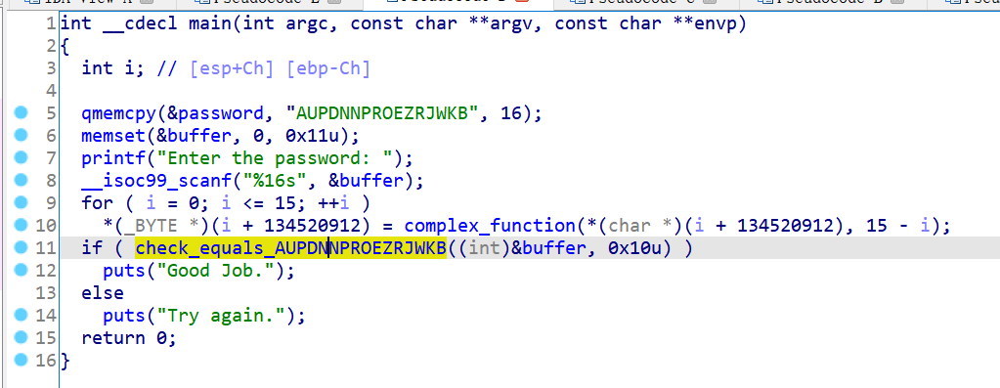

angr在符号执行的过程中，会将路径约束保存在SimState内置的约束求解器内，这一节我们学习如何手动添加约束并进行约束求解，以及应对*路径爆炸*的一些方法。

## 08_angr_constraints

这题的流程是先对输入加密，然后调用check_equals_xxx函数对加密后的输入进行比较，若比对成功则输出"Good Job."：



check_equals_AUPDNNPROEZRJWKB函数会将输入与"AUPDNNPROEZRJWKB"进行比较：


这题直接调用explore是跑不出来的，因为在check_equals函数中不是比对失败就立刻退出循环，而是一直循环到最后。总共有16轮循环，每次循环会产生比对成功和比对失败两个状态，所以符号执行总共会产生2<sup>16</sup>个状态，导致*路径爆炸*：

```python
simgr.explore(find=lambda state : b'Good Job.' in state.posix.dumps(1))	# 不行
```

但实际上这个比较函数非常简单，根本没有必要去让angr跑，我们可以手动添加这个约束，然后进行求解：


```python
simgr.explore(find=0x8048669)	# 执行check_equals_AUPDNNPROEZRJWKB函数之前
found = simgr.found[0]
found.add_constraints(found.memory.load(buffer_addr, 16) == b'AUPDNNPROEZRJWKB')
print(found.solver.eval(password, cast_to=bytes))
```

完整代码：

```python
import angr
import claripy

proj = angr.Project('../dist/08_angr_constraints')
state = proj.factory.blank_state(addr=0x8048622)
password = claripy.BVS('password', 16 * 8)
buffer_addr = 0x804A050
state.memory.store(buffer_addr, password)
simgr = proj.factory.simgr(state)
simgr.explore(find=0x8048669)
found = simgr.found[0]
found.add_constraints(found.memory.load(buffer_addr, 16) == b'AUPDNNPROEZRJWKB')
print(found.solver.eval(password, cast_to=bytes))
```

输出：

```python
b'LGCRCDGJHYUNGUJB'
```

## 路径爆炸

路径爆炸的概念与数学中的**指数爆炸**概念类似，即某些情况下符号执行的路径/状态以指数级增长。

从`08_angr_constraints`中我们发现，即使是非常简单的比较函数，也可能让angr产生指数级的路径（2<sup>16</sup>条路径），耗费大量时间甚至根本跑不出来，这就是符号执行的重大缺陷之一——路径爆炸。这既是我们在用符号执行解决实际问题时需要注意的问题，也是一种可以用来抗符号执行的思路。

应对路径爆炸的方法有很多，甚至还有专门的论文来讲述缓解路径爆炸的方法，在上一题中我们学到了最简单的一种：避开会产生路径爆炸的函数，用手动添加约束替代，这是最简单，也是非常好用的一种方法。总的来说，读者们在使用符号执行引擎时，要识别那些会导致路径爆炸的代码，并巧妙绕过。