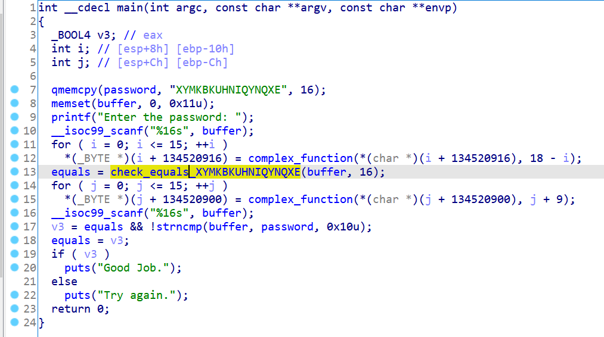

这一节我们来学习避免路径爆炸的另一种方法——hook。对逆向已经比较熟悉的读者应该能很快理解hook的意思。hook也就是钩子的意思，简单来说，hook就是将一段代码或一个函数“钩住”，替换为我们自己的代码，类似“偷梁换柱”。如果现在还不理解hook的含义也没关系，我们马上通过一些实例学习。

## 09_angr_hooks

这一题的程序流程与上题类似，也是有一个会引起路径爆炸的比较函数。与上题不同的是，这题的比较函数不在整个加密流程的最后，所以我们不能再采用上题手动添加约束并求解的方法：



怎么办呢？既然check_equals函数本身的流程非常简单，那么我们就可以用hook技术将check_equals函数替换为一个**等效的并且不会导致路径爆炸的函数**，然后再进行符号执行：

```python
@proj.hook(addr=0x80486B3, length=5)  # check_equals_XYMKBKUHNIQYNQXE
def my_check_equals(state):
    buffer_addr = 0x804A054
    buffer = state.memory.load(buffer_addr, 16)
    state.regs.eax = claripy.If(buffer == b'XYMKBKUHNIQYNQXE', claripy.BVV(1, 32), claripy.BVV(0, 32))
```

注意这里的hook是对call指令进行了hook，而不是函数本身，length指的是跳过的字节数，call指令占5个字节，所以length=5：


至于这个语法：

```python
@proj.hook(addr=0x80486B3, length=5)  # check_equals_XYMKBKUHNIQYNQXE
```

叫做*注解*，具体的用法请读者去网上搜索，这里不再赘述。这个写法与上述的写法是等价的：

```python
def my_check_equals(state):
    buffer_addr = 0x804A054
    buffer = state.memory.load(buffer_addr, 16)
    state.regs.eax = claripy.If(buffer == b'XYMKBKUHNIQYNQXE', claripy.BVV(1, 32), claripy.BVV(0, 32))
    
proj.hook(addr=0x80486B3, hook=my_check_equals, length=5)
```

解决掉这个会导致路径爆炸的函数之后就好办了，直接explore，代码如下：

```python
import angr
import claripy

proj = angr.Project('../dist/09_angr_hooks')

@proj.hook(addr=0x80486B3, length=5)  # check_equals_XYMKBKUHNIQYNQXE
def my_check_equals(state):
    buffer_addr = 0x804A054
    buffer = state.memory.load(buffer_addr, 16)
    state.regs.eax = claripy.If(buffer == b'XYMKBKUHNIQYNQXE', claripy.BVV(1, 32), claripy.BVV(0, 32))
    
state = proj.factory.entry_state()
simgr = proj.factory.simgr(state)
simgr.explore(
    find=lambda state : b'Good Job.' in state.posix.dumps(1),
    avoid=lambda state: b'Try again.' in state.posix.dumps(1)
)
print(simgr.found[0].posix.dumps(0))
```

输出：

```python
b'ZXIDRXEORJOTFFJNWUFAOUBLOGLQCCGK'
```

## 10_angr_simprocedures

还是老套路——重复代码。现在我们没法hook所有掉call指令了，因为call指令实在是太多了！！！：


怎么办呢？接下来我们就要引入一种对函数本身进行hook的方法——SimProcedures，定义一个SimProcedures的代码如下：

```python
class MyCheckEquals(angr.SimProcedure):

    def run(self, buffer_addr, length):
        buffer = self.state.memory.load(buffer_addr, length)
        return claripy.If(buffer == b'ORSDDWXHZURJRBDH', claripy.BVV(1, 32), claripy.BVV(0, 32))
```

SimProcedure按字面意思来理解就是“模拟程序”，在这里我们用一个SimProcedure的子类MyCheckEquals模拟了check_equals_ORSDDWXHZURJRBDH函数的功能，SimProcedure中的run函数由子类实现，其接收的参数与C语言中的参数保持一致，返回为对应原函数的返回值。

定义好了SimProcedure之后，我们需要调用hook_symbol函数对程序中名为check_equals_ORSDDWXHZURJRBDH的函数进行hook：

```python
proj.hook_symbol(symbol_name='check_equals_ORSDDWXHZURJRBDH', simproc=MyCheckEquals())
```

hook之后angr在符号执行的过程中将不会调用原先的check_equals_ORSDDWXHZURJRBDH函数，而且MyCheckEquals类中的run函数。然后我们就可以用老方法解决这道题了，完整代码：

```python
import angr
import claripy

class MyCheckEquals(angr.SimProcedure):

    def run(self, buffer_addr, length):
        buffer = self.state.memory.load(buffer_addr, length)
        return claripy.If(buffer == b'ORSDDWXHZURJRBDH', claripy.BVV(1, 32), claripy.BVV(0, 32))

proj = angr.Project('../dist/10_angr_simprocedures')
proj.hook_symbol(symbol_name='check_equals_ORSDDWXHZURJRBDH', simproc=MyCheckEquals())
state = proj.factory.entry_state()
simgr = proj.factory.simgr(state)
simgr.explore(
    find=lambda state : b'Good Job.' in state.posix.dumps(1),
    avoid=lambda state: b'Try again.' in state.posix.dumps(1)
)
print(simgr.found[0].posix.dumps(0))
```

输出：

```python
b'MSWKNJNAVTTOZMRY'
```

## 11_angr_sim_scanf

关于这一题，angr_ctf给的说法是**angr不支持多个参数的scanf**：

```python
# This time, the solution involves simply replacing scanf with our own version,
# since Angr does not support requesting multiple parameters with scanf.
```

然而实际上是可以的，可能以前的版本不行，毕竟angr版本迭代还是很快的：

```python
import angr

proj = angr.Project('../dist/11_angr_sim_scanf')
state = proj.factory.entry_state()
simgr = proj.factory.simgr(state)
simgr.explore(
    find=lambda state : b'Good Job.' in state.posix.dumps(1),
    avoid=lambda state: b'Try again.' in state.posix.dumps(1)
)
print(simgr.found[0].posix.dumps(0))
```

输出：

```python
b'1448564819 1398294103'
```

虽然有点小乌龙，但不妨碍我们借此机会了解一下angr中自带的SimProcedures。angr在angr/procedures中定义了很多模拟系统函数的SimProcedures：


这些SimProcedures我们都可以通过angr.SIM_PROCEDURES来获得，用法如下：

```python
proj.hook_symbol("__isoc99_scanf", angr.SIM_PROCEDURES['libc']['scanf']())
```

根据我的猜测，angr会根据导入表自动识别**动态链接**的库函数并用自己实现的SimProcedures进行替换的（之所以说是猜测，是因为我还没看过这部分的源码，不过肯定八九不离十），所以这一步hook完全是多此一举。

完整代码：

```python
import angr

proj = angr.Project('../dist/11_angr_sim_scanf')
proj.hook_symbol("__isoc99_scanf", angr.SIM_PROCEDURES['libc']['scanf']())  # 多此一举
state = proj.factory.entry_state()
simgr = proj.factory.simgr(state)
simgr.explore(
    find=lambda state : b'Good Job.' in state.posix.dumps(1),
    avoid=lambda state: b'Try again.' in state.posix.dumps(1)
)
print(simgr.found[0].posix.dumps(0))
```

输出：

```python
b'1448564819 1398294103'
```

