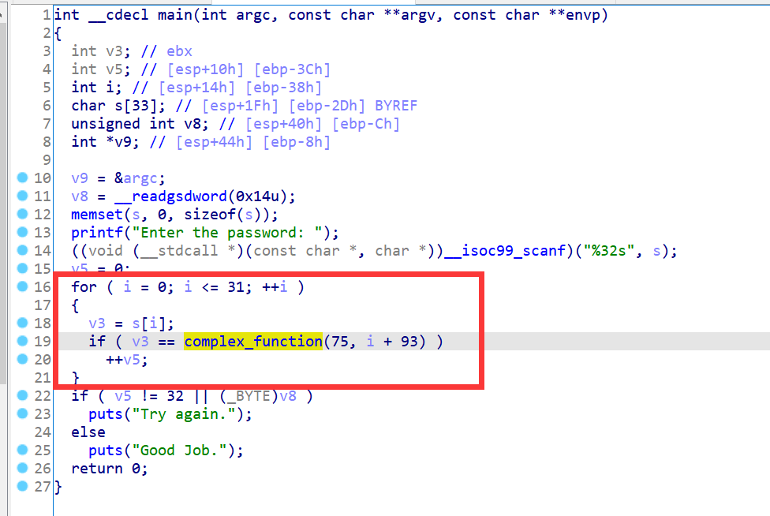

前面两节我们分别学习了应对路径爆炸的两种方法——手动约束和hook，这一节我们来学习有效缓解路径爆炸的第三种方法——Veritesting。

Veritesting意为路径归并，出自2014年的一篇论文[Enhancing Symbolic Execution with Veritesting](https://github.com/bluesadi/ReverseTools/tree/main/angr/attachment/06_angr_veritesting/veritesting-icse-2014.pdf)，具体原理就不说了，因为我也不懂（误）。

## 12_angr_veritesting

angr中实现了上述论文中提到的Veritesting技术，我们只需要在构建simgr的时候添加一个`veritesting=True`参数即可，代码如下：

```python
simgr = proj.factory.simgr(state, veritesting=True)
```

然后我们再来测试一下这一段会导致路径爆炸的代码：



```python
import angr

proj = angr.Project('../dist/12_angr_veritesting')
state = proj.factory.entry_state()
simgr = proj.factory.simgr(state, veritesting=True)
simgr.explore(
    find=lambda state : b'Good Job.' in state.posix.dumps(1),
    avoid=lambda state: b'Try again.' in state.posix.dumps(1)
)
print(simgr.found[0].posix.dumps(0))
```

跑出来还是要一段时间，但起码不会卡死了。输出：

```python
b'OQSUWYACEGIKMOQSUWYACEGIKMOQSUWY'
```

这种写法与上面的写法是等价的：

```python
simgr = proj.factory.simgr(state)
simgr.use_technique(angr.exploration_techniques.Veritesting())
```

另外根据官方的说法：

> Note that it frequenly doesn't play nice with other techniques due to the invasive way it implements static symbolic execution.

Versitesting通常与其他exploration techniques不兼容。