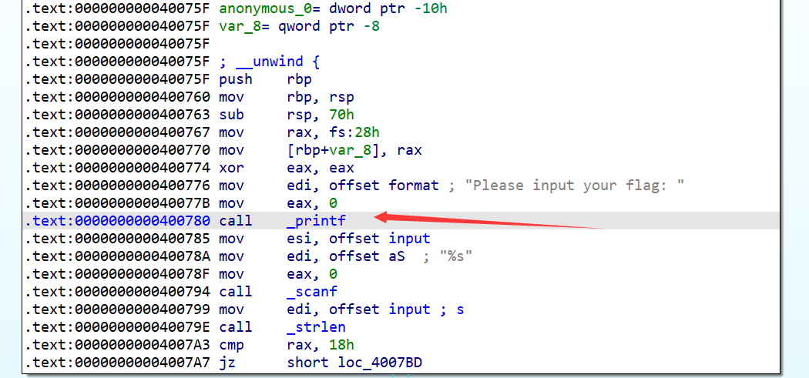
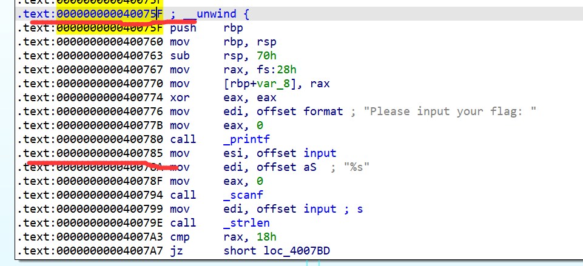

在第0节中，我们用C语言代码表示了符号执行过程，而实际上angr的符号执行既不是基于C语言，也不是基于汇编，而是是基于一种特定的中间代码（Intermediate Representation, IR）——VEX。

这一节我们将通过一个例子来简单了解VEX IR，不同架构的汇编转化为VEX IR略有区别，这里以x86为例。

## 0x00. x86架构下的VEX IR

编译一个简单的程序：

```cpp
#include <cstdio>
#include <cstring>
#include <cstdlib>

char input[100] = {0};
char enc[100] = "\x86\x8a\x7d\x87\x93\x8b\x4d\x81\x80\x8a\x43\x7f\x86\x4b\x84\x7f\x51\x90\x7f\x62\x2b\x6d\x2c\x91";

void encrypt(unsigned char *dest, char *src){
    int len = strlen(src);
    for(int i = 0;i < len;i ++){
        dest[i] = (src[i] + (32 - i)) ^ i;
    }
}


// flag{s1mpl3_v3x_1r_d3m0}
int main(){
    printf("Please input your flag: ");
    scanf("%s", input);
    if(strlen(input) != 24){
        printf("Wrong length!\n");
        exit(0);
    }
    unsigned char dest[100] = {0};
    encrypt(dest, input);
    if(!memcmp(dest, enc, 24)){
        printf("Congratulations~\n");
    }else{
        printf("Sorry try again.\n");
    }
}
```


写一个简单的demo输出一下main函数第一个基本块的VEX IR，irsb的含义是*IR Super Block*，大概意思是由VEX IR指令组成的一个基本块：

```python
import angr

proj = angr.Project('TestProgram')
block = proj.factory.block(0x40075F)
irsb = block.vex
irsb.pp()
```

运行输出如下：

```vex
IRSB {
   t0:Ity_I64 t1:Ity_I64 t2:Ity_I64 t3:Ity_I64 t4:Ity_I64 t5:Ity_I64 t6:Ity_I64 t7:Ity_I32 t8:Ity_I32 t9:Ity_I32 t10:Ity_I64 t11:Ity_I64 t12:Ity_I64 t13:Ity_I64 t14:Ity_I64 t15:Ity_I64 
t16:Ity_I64 t17:Ity_I64 t18:Ity_I64 t19:Ity_I64 t20:Ity_I64 t21:Ity_I64 t22:Ity_I32 t23:Ity_I64 t24:Ity_I32 t25:Ity_I64 t26:Ity_I64 t27:Ity_I64 t28:Ity_I64 t29:Ity_I64 t30:Ity_I64 t31:Ity_I64 t32:Ity_I64 t33:Ity_I64

   00 | ------ IMark(0x40075f, 1, 0) ------
   01 | t0 = GET:I64(rbp)
   02 | t13 = GET:I64(rsp)
   03 | t12 = Sub64(t13,0x0000000000000008)
   04 | PUT(rsp) = t12
   05 | STle(t12) = t0
   06 | ------ IMark(0x400760, 3, 0) ------
   07 | PUT(rbp) = t12
   08 | ------ IMark(0x400763, 4, 0) ------
   09 | t2 = Sub64(t12,0x0000000000000070)
   10 | PUT(rsp) = t2
   11 | PUT(rip) = 0x0000000000400767
   12 | ------ IMark(0x400767, 9, 0) ------
   13 | t16 = GET:I64(fs)
   14 | t15 = Add64(0x0000000000000028,t16)
   15 | t17 = LDle:I64(t15)
   16 | PUT(rip) = 0x0000000000400770
   17 | ------ IMark(0x400770, 4, 0) ------
   18 | t18 = Add64(t12,0xfffffffffffffff8)
   19 | STle(t18) = t17
   20 | ------ IMark(0x400774, 2, 0) ------
   21 | PUT(cc_op) = 0x0000000000000013
   22 | PUT(cc_dep1) = 0x0000000000000000
   23 | PUT(cc_dep2) = 0x0000000000000000
   24 | ------ IMark(0x400776, 5, 0) ------
   25 | PUT(rdi) = 0x00000000004008c4
   26 | ------ IMark(0x40077b, 5, 0) ------
   27 | PUT(rax) = 0x0000000000000000
   28 | PUT(rip) = 0x0000000000400780
   29 | ------ IMark(0x400780, 5, 0) ------
   30 | t30 = Sub64(t2,0x0000000000000008)
   31 | PUT(rsp) = t30
   32 | STle(t30) = 0x0000000000400785
   33 | t32 = Sub64(t30,0x0000000000000080)
   34 | ====== AbiHint(0xt32, 128, 0x00000000004005a0) ======
   NEXT: PUT(rip) = 0x00000000004005a0; Ijk_Call
}
```

可以看到大部分的VEX IR就是把一条汇编指令用多条VEX IR指令替代，比如`push rbp`被替换成了：

```vex
   00 | ------ IMark(0x40075f, 1, 0) ------
   01 | t0 = GET:I64(rbp)
   02 | t13 = GET:I64(rsp)
   03 | t12 = Sub64(t13,0x0000000000000008)
   04 | PUT(rsp) = t12
   05 | STle(t12) = t0
```

其中`t0`、`t13`、`t12`等以t开头变量在VEX IR中都叫做临时变量（temporary variable）。STle指令的含义为Store Memory，除了这条指令其他指令的含义应该都比较好理解。本文不可能把所有VEX IR指令都解释一遍，所以具体的解释请查看angr的官方文档[Intermediate Representation](https://docs.angr.io/advanced-topics/ir)以及附属链接。

不同于IDA中的CFG，VEX IR会将call指令也视作一种跳转，所以这个irsb以一条call指令结束了：

```python
   NEXT: PUT(rip) = 0x00000000004005a0; Ijk_Call
```

对应IDA CFG中的`call _printf`这条指令：



## 0x01. 符号执行过程中的VEX IR

写一个简单的demo来看一下angr符号执行中每次step的单位：

```python
import angr

proj = angr.Project('TestProgram')
state = proj.factory.entry_state()
simgr = proj.factory.simgr(state)
while len(simgr.active):
    print('--------------')
    for active in simgr.active:
        print(hex(active.addr))
        if b'Congratulations~' in active.posix.dumps(1):
            print(active.posix.dumps(0))
    simgr.step()
```

部分输出如下：

```python
--------------
0x40075f
--------------
0x4005a0
--------------
0x700018
--------------
0x400785
--------------
0x4005d0
```

可以发现simgr的step函数是以一个irsb为单位进行符号执行的，也就是说每次step之后的状态，是在上一次state的基础上，符号执行一个irsb之后的结果：



当前要执行的irsb可以通过state.scratch.irsb获得：

```vex
>>> active.scratch.irsb
IRSB {
   t0:Ity_I64 t1:Ity_I64 t2:Ity_I64 t3:Ity_I64 t4:Ity_I64 t5:Ity_I64 t6:Ity_I64 t7:Ity_I64

   00 | ------ IMark(0x400834, 1, 0) ------
   01 | t0 = GET:I64(rbp)
   02 | PUT(rsp) = t0
   03 | t1 = LDle:I64(t0)
   04 | PUT(rbp) = t1
   05 | t5 = Add64(t0,0x0000000000000008)
   06 | PUT(rsp) = t5
   07 | PUT(rip) = 0x0000000000400835
   08 | ------ IMark(0x400835, 1, 0) ------
   09 | t3 = LDle:I64(t5)
   10 | t4 = Add64(t5,0x0000000000000008)
   11 | PUT(rsp) = t4
   12 | t6 = Sub64(t4,0x0000000000000080)
   13 | ====== AbiHint(0xt6, 128, t3) ======
   NEXT: PUT(rip) = t3; Ijk_Ret
}
```

## 0x02. 通过statement断点监控符号执行过程

通过step函数我们可以以irsb为单位监控符号执行的过程，而angr的inspect机制则可以让我们监控一些额外的事件，这些事件包括（来自[angr/angr/state_plugins/inspect.py](https://github.com/angr/angr/blob/master/angr/state_plugins/inspect.py)）：

```python
event_types = {
    'vex_lift',
    'mem_read',
    'mem_write',
    'address_concretization',
    'reg_read',
    'reg_write',
    'tmp_read',
    'tmp_write',
    'expr',
    'statement',
    'instruction',
    'irsb',
    'constraints',
    'exit',
    'fork',
    'symbolic_variable',
    'call',
    'return',
    'simprocedure',
    'dirty',
    'syscall',
    'cfg_handle_job',
    'vfg_handle_successor',
    'vfg_widen_state',
    'engine_process',
    'memory_page_map',
}
```

其中statement意为一条VEX IR指令，对statement进行监控即对每条VEX IR指令进行监控，监控的方法为对statement事件下断点，代码如下：

```python
state.inspect.b('statement', when=BP_BEFORE, action=action)
```

action是一个需要SimState参数的函数：

```python
def action(state):
    print(state.scratch.irsb.statements[state.inspect.statement])
```

可以通过：

```python
state.scratch.irsb.statements[state.inspect.statement]
```

来获取当前正在执行的VEX IR指令，例如：

```python
t6 = Sub64(t4,0x0000000000000080)
```

通过：

```python
list(state.scratch.irsb.statements[state.inspect.statement].expressions)
```

对当前的statement进行拆分，一个例子如下：

```python
>>> state.scratch.irsb.statements[state.inspect.statement]
t6 = Sub64(t4,0x0000000000000080)
>>> list(state.scratch.irsb.statements[state.inspect.statement].expressions)
[<pyvex.expr.Binop object at 0x000002282817E780>, <pyvex.expr.RdTmp object at 0x0000022822CBDD60>, <pyvex.expr.Const object at 0x0000022822D356D0>]
```

Sub64对应Binop，即二元运算（Binary Operation）；RdTmp对应t4，读取一个临时变量；Const对应常数0x80。

之前我们通过state来修改寄存器、内存，进而改变当前符号执行的状态。那么问题来了，我们可不可以基于VEX IR来修改符号执行的状态呢？答案将在下一节——*利用angr符号执行去除控制流平坦化*揭晓。VEX IR的内容差不多就讲到这了，想更深入了解VEX IR的读者可以通过angr的官方文档和angr以及pyvex的源代码学习。

