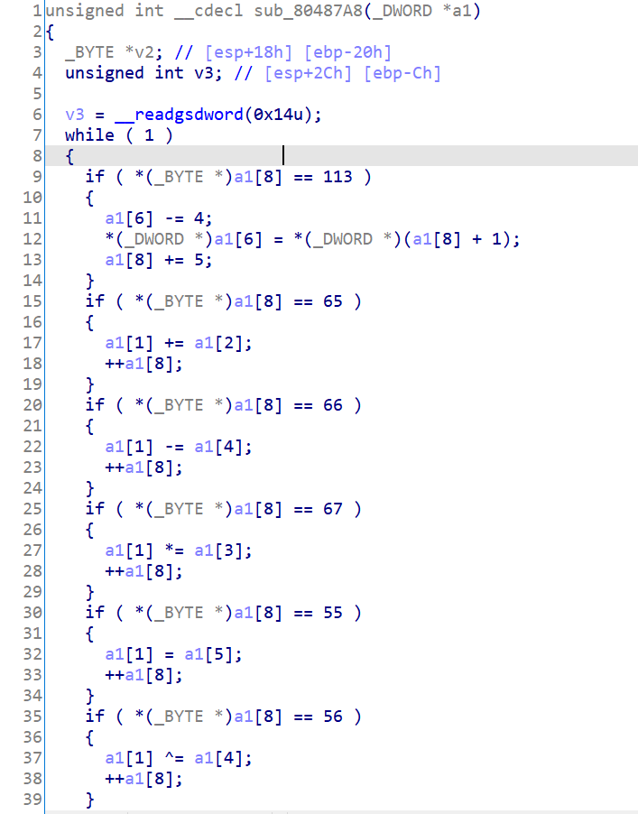

如果读者已经做过一些CTF赛题，或者已经对CTF赛事非常熟悉，那么一定了解过VM这类题型。VM的特点就是用非常复杂的代码表示其实并不复杂的加密流程，如果手动分析的话对逆向者来说是个体力活，但是利用angr则可以做到让我们在不分析VM指令的情况下得到flag。

以2021羊城杯的[EasyVM](https://github.com/bluesadi/0x401RevTrain-Tools/tree/main/angr/attachment/EasyVM)为例，注意**不是所有的VM题都能用angr梭哈，要具体情况具体分析**！

## 0x00. 2021羊城杯EasyVM题解（angr梭哈解法）

这是一道典型的VM题，顺便套了个SMC的娃，动态调试即可得到真正的VM代码：



一开始我想尝试用explore直接跑，跑不出来：

```python
import angr
import claripy

proj = angr.Project('EasyVM')
flag = claripy.BVS('flag', 100 * 8)
state = proj.factory.entry_state(stdin=flag)
simgr = proj.factory.simgr(state)
simgr.explore(find=0x80492B2)
print(simgr)
print(simgr.found[0])
print(simgr.found[0].solver.eval(flag))
```

但当我换成while+step之后就能跑出来了，真是玄学，有机会读一读explore的源码一探究竟：

```python
import angr
import claripy
import sys

proj = angr.Project('EasyVM')
flag = claripy.BVS('flag', 100 * 8)
state = proj.factory.entry_state(stdin=flag)
simgr = proj.factory.simgr(state)
while len(simgr.active):
    for active in simgr.active:
        if active.addr == 0x80492B2:
            print(active.solver.eval(flag, cast_to=bytes))
            sys.exit(0)
    simgr.step()
```

输出：

```python
b'16584abc45baff901c59dde3b1bb6701a254b06cdc23\x00\x00\x00\x00\x00\x00\x00\x00\x00\x00\x00\x00\x00\x00\x00\x00\x00\x00\x00\x00\x00\x00\x00\x00\x00\x00\x00\x00\x00\x00\x00\x00\x00\x00\x00\x00\x00\x00\x00\x00\x00\x00\x00\x00\x00\x00\x00\x00\x00\x00\x00\x00\x00\x00\x00\x00'
```