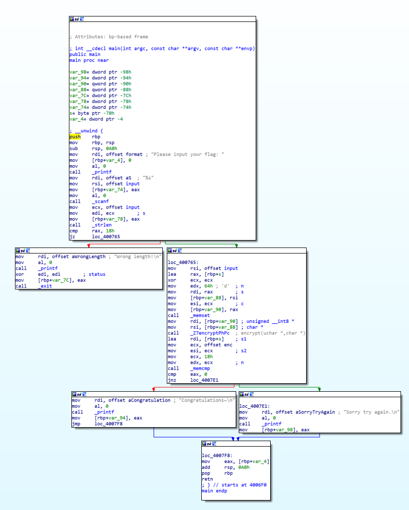
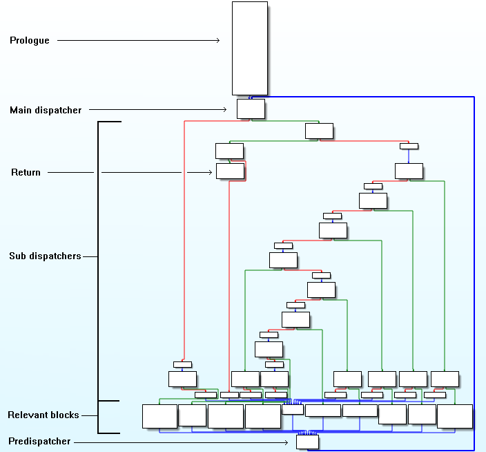
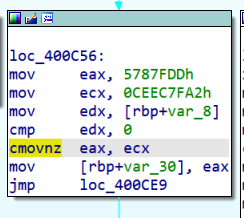
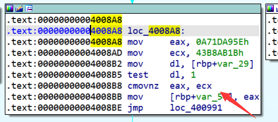
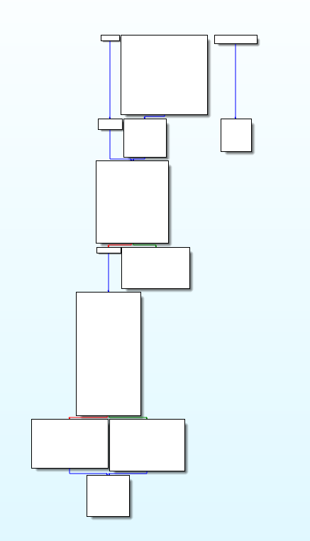
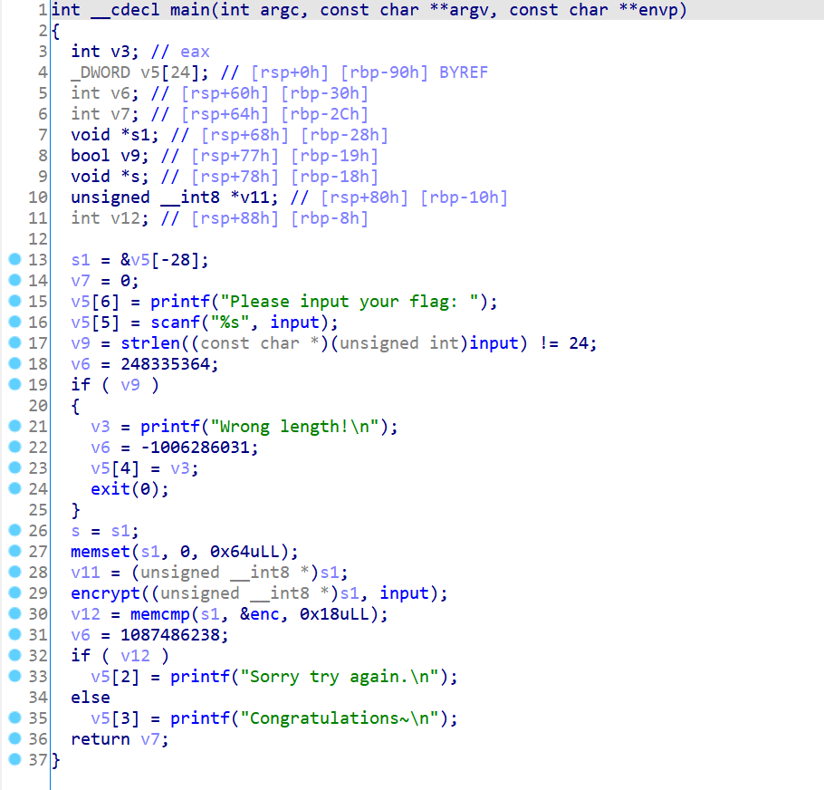

最后一节我们学习如何用angr解决实际问题——利用angr符号执行去除控制流平坦化。在阅读本节教程之前，你需要先了解什么是控制流平坦化，这里不再赘述：

- [Control Flow Flattening](https://github.com/obfuscator-llvm/obfuscator/wiki/Control-Flow-Flattening)
- [基于LLVM Pass实现控制流平坦化 ](https://bbs.pediy.com/thread-266082.htm)

本节的内容主要是是腾讯应急响应中心2017年一篇博客的复现，因此一些原文已经解释得很清楚的内容不会在本节重述：

- [利用符号执行去除控制流平坦化](https://security.tencent.com/index.php/blog/msg/112)

同时也参考了QuarksLab的这篇博客：

- [Deobfuscation: recovering an OLLVM-protected program](https://blog.quarkslab.com/deobfuscation-recovering-an-ollvm-protected-program.html)

代码主要参考：

- [cq674350529/deflat](https://github.com/cq674350529/deflat/blob/master/flat_control_flow/deflat.py)

## 0x00. 初步分析

还是按照惯例我们通过一个简单的程序进行讲解：

```cpp
#include <cstdio>
#include <cstring>
#include <cstdlib>

char input[100] = {0};
char enc[100] = "\x86\x8a\x7d\x87\x93\x8b\x4d\x81\x80\x8a\x43\x7f\x86\x4b\x84\x7f\x51\x90\x7f\x62\x2b\x6d\x2c\x91";

void encrypt(unsigned char *dest, char *src){
    int len = strlen(src);
    for(int i = 0;i < len;i ++){
        dest[i] = (src[i] + (32 - i)) ^ i;
    }
}


// flag{s1mpl3_v3x_1r_d3m0}
int main(){
    printf("Please input your flag: ");
    scanf("%s", input);
    if(strlen(input) != 24){
        printf("Wrong length!\n");
        exit(0);
    }
    unsigned char dest[100] = {0};
    encrypt(dest, input);
    if(!memcmp(dest, enc, 24)){
        printf("Congratulations~\n");
    }else{
        printf("Sorry try again.\n");
    }
}
```

在Ubuntu下编译正常的可执行文件：

```sh
clang TestProgram.cpp -o TestProgram
```

编译控制流平坦化混淆后的可执行文件：

```sh
clang -mllvm -fla -mllvm -split -mllvm -split_num=3 TestProgram.cpp -o TestProgram_fla
```

在IDA中打开这两个可执行文件，首先是正常的可执行文件TestProgram，CFG的逻辑比较清晰易懂：



再看看控制流平坦化混淆后的CFG，虽然程序逻辑已经被混淆了，但其结构还是有规律可循的：


控制流平坦化后的CFG中的基本块大致可以分为以下几类，这几类基本块的含义读者可以阅读腾讯应急响应实验室的那篇博客，这里不再赘述：



总结来说，利用angr符号执行去除控制流平坦化的步骤可以归结为三个步骤：

1. 静态分析CFG得到序言/入口块（Prologue）、主分发器（Main dispatcher）、子分发器/无用块（Sub dispatchers）、真实块（Relevant blocks）、预分发器（Predispatcher）和返回块（Return）
2. 利用符号执行恢复真实块的前后关系，重建控制流
3. 根据第二步重建的控制流Patch程序，输出恢复后的可执行文件

## 0x01. 静态分析CFG

整个程序的CFG可以通过CFGFast函数得到：

```python
cfg = proj.analyses.CFGFast(normalize=True, force_complete_scan=False)
```

但angr的CFG会将call指令也视为跳转的一种，作为基本块的最后一条指令，而IDA中只会将jmp一类的指令以及ret和call exit作为基本块的最后一条指令，并且IDA中的CFG是以函数为单位的，而不是整个程序：


所以我们要通过angrmangement中的to_supergraph函数将angr的CFG单个函数的CFG，再转化为类似IDA的CFG，代码如下：

```python
def get_cfg():
    cfg = proj.analyses.CFGFast(normalize=True, force_complete_scan=False)
    function_cfg = cfg.functions.get(start).transition_graph
    super_cfg = to_supergraph(function_cfg)
    return super_cfg
```

这样我们就得到了一个类似IDA的CFG，接着我们要通过分析平坦化后的控制流的结构规律来识别出各类型的基本块，识别方法如下：

- 序言/入口块（Prologue）：没有前驱块的基本块即是入口块

```python
for node in cfg.nodes:
    if cfg.in_degree(node) == 0:
        prologue_node = node
```

- 返回块（Return）：没有后继块的基本块即是返回块，返回块可能有多个

```python
retn_nodes = []
for node in cfg.nodes:
    if cfg.in_degree(node) == 0:
        prologue_node = node
    elif cfg.out_degree(node) == 0:
        retn_nodes.append(node)
```

- 主分发器（Main dispatcher）：入口块的后继块即为主分发器

```python
main_dispatcher_node = list(cfg.successors(prologue_node))[0]
```

- 预分发器（Predispatcher）：主分发器的前驱块，且不为入口块

```python
for node in cfg.predecessors(main_dispatcher_node):
    if node.addr != prologue_node.addr:
        predispatcher_node = node
        break
```

- 真实块（Relevant blocks）：预分发器的前驱块，为了后续处理方便，这里也把入口块算作真实块

```python
relevant_nodes = [prologue_node]
for node in cfg.nodes:
    if node in cfg.predecessors(predispatcher_node):
        relevant_nodes.append(node)
```

- 子分发器/无用块（Sub dispatchers）：除上述基本块之外的基本块都为子分发器，因为子分发器再恢复之后的控制流中不起任何作用，所以也叫作无用块，之后要被Nop掉

```python
relevant_nodes = [prologue_node]
sub_dispatcher_nodes = []
for node in cfg.nodes:
    if node in cfg.predecessors(predispatcher_node):
        relevant_nodes.append(node)
    elif node != prologue_node and node not in retn_nodes:
        sub_dispatcher_nodes.append(node)
```

完整代码如下：

```python
def analyse_blocks():
    retn_nodes = []
    for node in cfg.nodes:
        if cfg.in_degree(node) == 0:
            prologue_node = node
        elif cfg.out_degree(node) == 0:
            retn_nodes.append(node)
    main_dispatcher_node = list(cfg.successors(prologue_node))[0]
    for node in cfg.predecessors(main_dispatcher_node):
        if node.addr != prologue_node.addr:
            predispatcher_node = node
            break
    relevant_nodes = [prologue_node]
    sub_dispatcher_nodes = []
    for node in cfg.nodes:
        if node in cfg.predecessors(predispatcher_node):
            relevant_nodes.append(node)
        elif node != prologue_node and node not in retn_nodes:
            sub_dispatcher_nodes.append(node)
    return prologue_node, main_dispatcher_node, sub_dispatcher_nodes, retn_nodes, relevant_nodes, predispatcher_node
```

## 0x02. 重建控制流

在这一步中我们要通过符号执行来确定真实块之间的前后关系，真实块之间的前后关系又分为两类：

1. 有一个确定的后继块
2. 有两个后继块，跳转到哪个由某个条件决定

第一种情况非常好处理，我们从一个真实块A开始符号执行，直到碰到下一个真实块B，那么我们就确定了一对基本块的执行顺序A→B。

第二种情况我们需要先令该条件为True，然后进行符号执行，得到一个后继真实块的地址；再令条件为False，然后进行符号执行，得到另一个后继真实块的地址。思路比较简单，但代码写起来会稍微有点复杂。

有一个确定后继块的真实块是比较简单的，这类基本块会在末尾修改switch变量的值，在下一次进入分发器时就能达到另一个真实块：


这类则是具有两个可能后继块的真实块，cmovnz有点类似jnz指令，会在ZF为0时执行mov eax, ecx操作，而ZF为1时不做处理。所有这类真实块都包含cmovnz或cmovz指令，可以通过这一特征判定真实块是具有分支：



第二步的代码如下：

```python
relevant_addrs = [node.addr for node in relevant_nodes]
relevant_addrs += [node.addr for node in retn_nodes]
patch_addrs = {}
cmov_types = {}
flow = defaultdict(list)
for node in relevant_nodes:
    block_addr = node.addr
    has_branch = preprocess(block_addr)
    if has_branch:
        symbolic_execute(block_addr, modify_cond=claripy.BVV(1, 1))
        symbolic_execute(block_addr, modify_cond=claripy.BVV(0, 1))
    else:
        symbolic_execute(block_addr)
for node in relevant_nodes:
	block_addr = node.addr
    print('Real successors of block %#x: ' % block_addr, [hex(child) for child in flow[block_addr]])
```

- relevant_addrs此时包含入口块、真实块以及返回块的地址，当我们从一个真实块出发（不包含返回块）碰到relevant_addrs中的地址时，就还原了一对真实块的前后关系

- patch_addrs保存真实块中cmov指令的地址，以便第三步进行Patch
- cmov_types保存真实块中cmov指令的类型，比如cmovz、cmovnz等
- flow创建了一个默认类型为list的dict，保存真实块的后继块地址

preprocess对真实块中的call指令进行hook，因为这些call指令对接下来的符号执行完全没有作用；另外根据有无cmov指令判断改真实块是否有分支以及记录cmov指令的地址和类型：

```python
def preprocess(block_addr):
    def nop_proc(state):
        pass
    block = proj.factory.block(block_addr)
    has_branch = False
    for insn in block.capstone.insns:
        if insn.mnemonic == 'call':
            proj.hook(insn.address, hook=nop_proc, length=5)
            print('Hook [%s\t%s] at %#x' % (insn.mnemonic, insn.op_str, insn.address))
        elif insn.mnemonic.startswith('cmov'):
            has_branch = True
            patch_addrs[block_addr] = insn.address
            cmov_types[block_addr] = insn.mnemonic
    return has_branch
```

第一种情况：当前真实块没有分支，则symbolic_execute从一个真实块开始符号执行，直到碰到下一个真实块，往flow中添加下一个真实块的地址：

```python
def symbolic_execute(block_addr, modify_cond=None):
    simgr = proj.factory.simgr(state)
    simgr.step()
    while len(simgr.active):
        for active in simgr.active:
            if active.addr in relevant_addrs:
                flow[block_addr].append(active.addr)
                return
        simgr.step()
    print('Error at block %#x' % block_addr)
```

第二种情况：当前真实块有分支，那么我们需要令分支的条件分别为True和False符号执行两次，分别得到两个后继真实块的地址：

```python
def symbolic_execute(block_addr, modify_cond=None):
    def modify_ITE_cond(state):
        expressions = list(state.scratch.irsb.statements[state.inspect.statement].expressions)
        if len(expressions) != 0 and isinstance(expressions[0], pyvex.expr.ITE):
            state.scratch.temps[expressions[0].cond.tmp] = modify_cond
            state.inspect._breakpoints['statement'] = []

    state = proj.factory.blank_state(addr=block_addr, remove_options={
                                        angr.sim_options.LAZY_SOLVES})
    if modify_cond is not None:
        state.inspect.b('statement',when=BP_BEFORE, action=modify_ITE_cond)
    simgr = proj.factory.simgr(state)
    simgr.step()
    while len(simgr.active):
        for active in simgr.active:
            if active.addr in relevant_addrs:
                flow[block_addr].append(active.addr)
                return
        simgr.step()
    print('Error at block %#x' % block_addr)
```

这里我们通过statement断点监控了VEX IR中的ITE指令，通过修改ITE指令中的临时变量改变了符号执行的状态，ITE指令类似于C语言中的三元运算符：


写个简单的程序打印一下VEX IR，对比ITE指令与原指令的对应关系：

```python
import angr

proj = angr.Project('TestProgram_fla')
block = proj.factory.block(0x4008A8)
block.vex.pp()
```

输出：

```vex
   00 | ------ IMark(0x4008a8, 5, 0) ------
...
   16 | ------ IMark(0x4008b8, 3, 0) ------
   17 | t34 = And64(t13,0x00000000000000ff)
   18 | t33 = CmpNE64(t34,0x0000000000000000)
   19 | t32 = 1Uto64(t33)
   20 | t25 = t32
   21 | t35 = 64to1(t25)
   22 | t20 = t35
   23 | t36 = ITE(t20,0x43b8ab1b,0xa71da95e)
   24 | t19 = t36
   25 | t37 = 32Uto64(t19)
   26 | t18 = t37
   27 | PUT(rax) = t18
   28 | PUT(rip) = 0x00000000004008bb
   29 | ------ IMark(0x4008bb, 3, 0) ------
...
}
```

可以看到VEX IR用包括ITE在内的多条指令表示了cmovnz这一条汇编指令：



以`t36 = ITE(t20,0x43b8ab1b,0xa71da95e)`这条指令为例，如果t20为True，那么t36就等于0x43b8ab1b，如果t20为False，那么t36就等于0xa71da95e。在symbolic_execute函数中，我们通过statement断点完成了这一操作：

```python
def modify_ITE_cond(state):
    expressions = list(state.scratch.irsb.statements[state.inspect.statement].expressions)
    if len(expressions) != 0 and isinstance(expressions[0], pyvex.expr.ITE):
        state.scratch.temps[expressions[0].cond.tmp] = modify_cond
        state.inspect._breakpoints['statement'] = []
        
if modify_cond is not None:
	state.inspect.b('statement',when=BP_BEFORE, action=modify_ITE_cond)
```

这样便成功还原了真实块原先的前后关系，或者说重建了控制流。

## 0x03. Patch程序

最后一步我们要第二步中重建的控制流Patch程序，并输出恢复后的可执行文件。

首先是将子分发器全部Nop掉，因为这些基本块在我们重建之后的控制流中不起任何作用：

```python
def fill_nops(addr, size):
    offset = addr - base_addr
    content[offset:offset + size] = b'\x90' * size
    
base_addr = proj.loader.main_object.mapped_base
with open(filename, 'rb') as file:
    content = bytearray(file.read())
for node in sub_dispatcher_nodes:
    fill_nops(node.addr, node.size)
    print('Fill nops from %#x to %#x' % (node.addr, node.addr + node.size))
```

对于没有分支的真实块，直接让他跳转到对应的后继真实块，注意入口块要做一个特殊处理，因为入口块的最后一条指令并不是jmp指令，所以要从主分发块的头部进行Patch：

```python
def fill_jmp(src, dest):
    offset = src - base_addr
    if dest != src + 5:
        content[offset] = 0xE9
        content[offset + 1:offset + 5] = (dest - src - 5).to_bytes(4, 'little', signed=True)
    else:
        fill_nops(src, 5)

for node in relevant_nodes:
    childs = flow[node.addr]
    if len(childs) == 1:
        patch_addr = node.addr + node.size - 5
    	if node.addr == prologue_node.addr:
            patch_addr = node.addr + node.size
        fill_jmp(patch_addr, childs[0])
        print('Patch jmp %#x at %#x' % (childs[0], patch_addr))
```


对于有分支的基本块，则根据cmov指令的类型进行Patch，至于为什么跳转指令的后缀要跟cmov指令的后缀保持一致读者开通脑筋想一想很容易就能得出答案，这是一个逻辑问题：

```python
def get_jx_opcode(jx_type):
    ks = Ks(KS_ARCH_X86, KS_MODE_32)
    code, count = ks.asm(f'{jx_type} 0xFFFFFFFF')
    return b''.join(map(lambda x: x.to_bytes(1, sys.byteorder), code[0:2]))

def fill_jx(src, dest, cmov_type):
    offset = src - base_addr
    content[offset:offset + 2] = get_jx_opcode(cmov_type.replace('cmov', 'j'))
    content[offset + 2:offset + 6] = (dest - src - 6).to_bytes(4, 'little', signed=True)

for node in relevant_nodes:
    childs = flow[node.addr]
    if len(childs) == 1:
        patch_addr = node.addr + node.size - 5
        if node.addr == prologue_node.addr:
            patch_addr = node.addr + node.size
            fill_jmp(patch_addr, childs[0])
            print('Patch jmp %#x at %#x' % (childs[0], patch_addr))
        elif len(childs) == 2:
            patch_addr = patch_addrs[node.addr]
            cmov_type = cmov_types[node.addr]
            fill_nops(patch_addr, node.addr + node.size - patch_addr)
            fill_jx(patch_addr, childs[0], cmov_type)
            fill_jmp(patch_addr + 6, childs[1])
            print('Patch jz %#x at %#x' % (childs[0], patch_addr))
            print('Patch jmp %#x at %#x' % (childs[1], patch_addr + 6))
```

最后再写入到新的文件：

```python
with open(args.out, 'wb') as file:
    file.write(content)
```

## 0x04. 检验反混淆效果

最后用之前的实例程序来检验脚本的反混淆效果，对main函数和encrypt函数进行反混淆：

```sh
python deflat.py -f samples/TestProgram_fla -s 4009A0 -o samples/dump
python deflat.py -f samples/dump -s 400680 -o samples/dump
```

恢复之后的main函数和encrypt函数的控制流：




恢复之后的伪代码，可以看到原程序的逻辑已经基本恢复正常了：




实际运行也没有错误：


## 0x05. 完整代码

```python
from collections import defaultdict
import angr
from angr.state_plugins.inspect import BP_BEFORE
from angrmanagement.utils.graph import to_supergraph
import argparse
import sys
import claripy
import logging
import pyvex
from keystone import *
logging.getLogger('angr.storage.memory_mixins.default_filler_mixin').setLevel(logging.ERROR)


def get_cfg():
    cfg = proj.analyses.CFGFast(normalize=True, force_complete_scan=False)
    function_cfg = cfg.functions.get(start).transition_graph
    super_cfg = to_supergraph(function_cfg)
    return super_cfg

def analyse_blocks():
    retn_nodes = []
    for node in cfg.nodes:
        if cfg.in_degree(node) == 0:
            prologue_node = node
        elif cfg.out_degree(node) == 0:
            retn_nodes.append(node)
    main_dispatcher_node = list(cfg.successors(prologue_node))[0]
    for node in cfg.predecessors(main_dispatcher_node):
        if node.addr != prologue_node.addr:
            predispatcher_node = node
            break
    relevant_nodes = [prologue_node]
    sub_dispatcher_nodes = []
    for node in cfg.nodes:
        if node in cfg.predecessors(predispatcher_node):
            relevant_nodes.append(node)
        elif node != prologue_node and node not in retn_nodes:
            sub_dispatcher_nodes.append(node)
    return prologue_node, main_dispatcher_node, sub_dispatcher_nodes, retn_nodes, relevant_nodes, predispatcher_node

def preprocess(block_addr):
    def nop_proc(state):
        pass
    block = proj.factory.block(block_addr)
    has_branch = False
    for insn in block.capstone.insns:
        if insn.mnemonic == 'call':
            proj.hook(insn.address, hook=nop_proc, length=5)
            print('Hook [%s\t%s] at %#x' % (insn.mnemonic, insn.op_str, insn.address))
        elif insn.mnemonic.startswith('cmov'):
            has_branch = True
            patch_addrs[block_addr] = insn.address
            cmov_types[block_addr] = insn.mnemonic
    return has_branch

def symbolic_execute(block_addr, modify_cond=None):
    def modify_ITE_cond(state):
        expressions = list(state.scratch.irsb.statements[state.inspect.statement].expressions)
        if len(expressions) != 0 and isinstance(expressions[0], pyvex.expr.ITE):
            state.scratch.temps[expressions[0].cond.tmp] = modify_cond
            state.inspect._breakpoints['statement'] = []

    state = proj.factory.blank_state(addr=block_addr, remove_options={
                                        angr.sim_options.LAZY_SOLVES})
    if modify_cond is not None:
        state.inspect.b('statement',when=BP_BEFORE, action=modify_ITE_cond)
    simgr = proj.factory.simgr(state)
    simgr.step()
    while len(simgr.active):
        for active in simgr.active:
            if active.addr in relevant_addrs:
                flow[block_addr].append(active.addr)
                return
        simgr.step()
    print('Error at block %#x' % block_addr)

def fill_nops(addr, size):
    offset = addr - base_addr
    content[offset:offset + size] = b'\x90' * size

def fill_jmp(src, dest):
    offset = src - base_addr
    if dest != src + 5:
        content[offset] = 0xE9
        content[offset + 1:offset + 5] = (dest - src - 5).to_bytes(4, 'little', signed=True)
    else:
        fill_nops(src, 5)

def get_jx_opcode(jx_type):
    ks = Ks(KS_ARCH_X86, KS_MODE_32)
    code, count = ks.asm(f'{jx_type} 0xFFFFFFFF')
    return b''.join(map(lambda x: x.to_bytes(1, sys.byteorder), code[0:2]))

def fill_jx(src, dest, cmov_type):
    offset = src - base_addr
    content[offset:offset + 2] = get_jx_opcode(cmov_type.replace('cmov', 'j'))
    content[offset + 2:offset + 6] = (dest - src - 6).to_bytes(4, 'little', signed=True)
        

if __name__ == '__main__':
    parser = argparse.ArgumentParser(description='Deobfuscate OLLVM Control Flow Flatten')
    parser.add_argument('-f', '--file', help='binary to deobfuscate')
    parser.add_argument('-s', '--start', help='start address of the deobfuscation')
    parser.add_argument('-o', '--out', help='output file path')
    args = parser.parse_args()
    if args.file is None or args.start is None or args.out is None:
        parser.print_help()
        sys.exit(0)
    filename = args.file            # 文件名
    start = int(args.start, 16)     # 起始地址
    # load_options={'auto_load_libs': False}
    # 避免生成cfg时解析到共享库的函数
    proj = angr.Project(filename, load_options={'auto_load_libs': False})

    # 第一步：获取函数CFG（类似于IDA的CFG）
    # 分析CFG得到入口块（序言）、主分发器、返回块、真实块、预分发块
    print('**************** Step-1 Static Analysis(1/3) ****************')
    cfg = get_cfg()
    prologue_node, main_dispatcher_node, sub_dispatcher_nodes, retn_nodes, relevant_nodes, predispatcher_node = analyse_blocks()
    print('Prologue block at %#x' % prologue_node.addr)
    print('Main dispatcher block at %#x' % main_dispatcher_node.addr)
    print('Sub dispatcher blocks at ', [hex(node.addr) for node in sub_dispatcher_nodes])
    print('Return blocks at ', [hex(node.addr) for node in retn_nodes])
    print('Relevant blocks at ', [hex(node.addr) for node in relevant_nodes])
    print('Predispatcher blocks at %#x' % predispatcher_node.addr)

    # 第二步：恢复真实块前后关系，重建控制流
    # 从一个真实块开始符号执行
    # 如果没有分支，计算出下一个到达的真实块
    # 如果有分支，条件为True时到达的真实块和条件为False时到达的真实块
    print('**************** Step-2 Recover Control Flow(2/3) ****************')
    relevant_addrs = [node.addr for node in relevant_nodes]
    relevant_addrs += [node.addr for node in retn_nodes]
    patch_addrs = {}
    cmov_types = {}
    flow = defaultdict(list)
    for node in relevant_nodes:
        block_addr = node.addr
        has_branch = preprocess(block_addr)
        if has_branch:
            symbolic_execute(block_addr, modify_cond=claripy.BVV(1, 1))
            symbolic_execute(block_addr, modify_cond=claripy.BVV(0, 1))
        else:
            symbolic_execute(block_addr)
    for node in relevant_nodes:
        block_addr = node.addr
        print('Real successors of block %#x: ' % block_addr, [hex(child) for child in flow[block_addr]])

    # 第三步：Patch程序，输出恢复后的可执行文件
    print('**************** Step-3 Patch Binary(3/3) ****************')
    base_addr = proj.loader.main_object.mapped_base
    with open(filename, 'rb') as file:
        content = bytearray(file.read())
    for node in sub_dispatcher_nodes:
        fill_nops(node.addr, node.size)
        print('Fill nops from %#x to %#x' % (node.addr, node.addr + node.size))
    for node in relevant_nodes:
        childs = flow[node.addr]
        if len(childs) == 1:
            patch_addr = node.addr + node.size - 5
            if node.addr == prologue_node.addr:
                patch_addr = node.addr + node.size
            fill_jmp(patch_addr, childs[0])
            print('Patch jmp %#x at %#x' % (childs[0], patch_addr))
        elif len(childs) == 2:
            patch_addr = patch_addrs[node.addr]
            cmov_type = cmov_types[node.addr]
            fill_nops(patch_addr, node.addr + node.size - patch_addr)
            fill_jx(patch_addr, childs[0], cmov_type)
            fill_jmp(patch_addr + 6, childs[1])
            print('Patch jz %#x at %#x' % (childs[0], patch_addr))
            print('Patch jmp %#x at %#x' % (childs[1], patch_addr + 6))
        else:
            print('Error')
            sys.exit(-1)
    with open(args.out, 'wb') as file:
        file.write(content)
```

